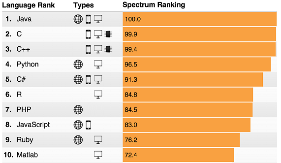
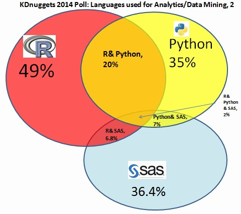
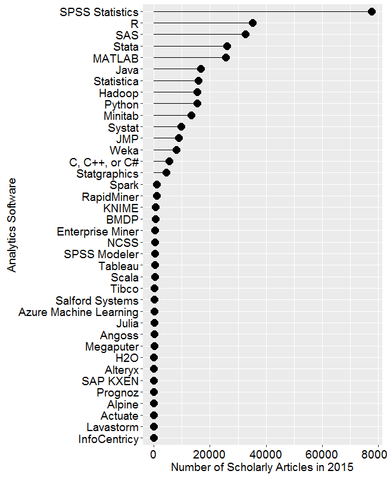

# Metody klasyfikacji binarnej
Marcin Kosiński Marcin.Kosinski@grupawp.pl  
`r Sys.Date()`  

# Analiza danych

## Czym jest analiza danych? {.build}

### Data analysis is the process by which data becomes understanding, knowledge and insight. Hadley Wickham.

# Czemu warto programować?

## Jeżeli wykonujemy analizy danych regularnie warto jest nauczyć się programować. | 3 główne zalety programowania {.build}

- **powtarzalność** - kody wykorzystane do analizy umożliwiają odtworzenie kroków pośrednich w trakcie analizy od stworzenia danych, poprzez manipulacje danych aż do ostatecznych wniosków płynących z danych.

- **automatyzacja** - pozwala na przeprowadzenie analiz dla nowo nabytych danych w oparciu o przygotowane kody z wcześniejszych analiz.

- **komunikacja** - kod jest narzędziem komunikacji pomiędzy użytkownikiem i komputerem ale także potężnym narzędziem w komunikacji między użytkownikami. 

# Czemu warto używać R?

## Czemu Warto używać R? | Skoro warto programować to czemu akurat w R? {.build}

Aby odpowiedzieć na to pytanie warto zastanowić się jakie są wąskie gardła analizy danych:

**Główne kategorie wąskich gardeł w trakcie analizy danych**

- **Obliczeniowa** - związana z wykorzystaniem komputera jako maszyny do obliczeń.

- **Poznawcza** - w trakcie analizy danych spędza się zdecydowaną większą część czasu na przemyśleniach
jak rozwiązać dany problem niż nad samym programowaniem rozwiązania.

Z tej racji do analizy danych nie jest potrzebny język programowania, który jest zoptymalizowany
na wydajność. Nie jest **aż tak** ważne czy jesteśmy w stanie przeprowadzić obliczenia 10 razy szybciej. 

Potrzebny jest język, który pomaga myśleć nad rozwiązaniem danego problemu i pomaga wyrażać myśli poprzez kod - **R się idealnie do tego nadaje**.

# Narzędzia analizy danych

## Narzędzia potrzebne w analizie danych {.build}

## Modele

Wizualizacje nie zawsze są najlepszą formą analizy danych, gdyż wymagają ludzkiego sprawdzenia i weryfikacji. Dlatego lepszym rozwiązaniem jest prosty zbiór automatycznych zasad i reguł wspieranych statystykami agregacyjnymi i prostymi algorytmami decyzyjnymi.

Taki zbiór zasad uznawany jest za **model**.

Modele są lepsze od wizualizacji bo

- się znakomicie skalują, 
- są zautomatyzowane,
- zawsze jest taniej kupić więcej komputerów niż mózgów.

# R

## Słabe strony R {.build}

R jako język i jako łącznik analizy danych zawiera pełny zbiór narzędzi do analizy danych. Jednak...

- **Wielu uważa, że R jest wolny** - ale nie powinniśmy wcale kłaść nacisku na optymalizowanie
języka, w którym się programuje lecz na optymalizowanie prędkości naszej analizy danych.

- **Dane do analizy muszą zmieścić się w RAMie** - R to środowisko do interaktywnej analizy danych, a żeby to robić całe dane muszą być w pamięci (amazon EC2 (https://aws.amazon.com/ec2/). Zazwyczaj analizy można wykonywać na dużych zbiorach również przez odpowiednie próbkowanie i agregowanie danych.

## Czym jest R? {.build}

- Open-source'owy język do analiz statystycznych.
- Standard dla badań statystycznych.
- Powstał z języka **S** (1976, odnowiony w 1988).
- Powstał na bazie Scheme i Fortrana.
- Wykorzystuje wiele funkcji napisanych w C i C++.
- Dziwaczny a zarazem odniósł wielki sukces.
- Środowisko do pracy statystycznej, posiadające swój język.

- Wysoki próg wejścia na krzywej uczenia.
- Nie należy się go uczyć w oderwaniu od statystyki (jak uczenie się języka PHP bez chęci pracy przy rozwoju stron internetowych).

## Rosnąca popularność R

[http://blog.revolutionanalytics.com/popularity/page/2/](http://blog.revolutionanalytics.com/popularity/page/2/)

## Rosnąca popularność R

[http://spectrum.ieee.org/computing/software/the-2015-top-ten-programming-languages](http://spectrum.ieee.org/computing/software/the-2015-top-ten-programming-languages)

## Rosnąca popularność R

[http://www.kdnuggets.com/2014/08/four-main-languages-analytics-data-mining-data-science.html](http://www.kdnuggets.com/2014/08/four-main-languages-analytics-data-mining-data-science.html)

## Sukcesy R

Wyniki corocznej ankiety KDnuggets.com, szczegółowe informacje na stronie [http://bit.ly/1Y8OX5W](http://bit.ly/1Y8OX5W)

## Sukcesy R

[http://www.r-bloggers.com/r-passes-sas-in-scholarly-use-finally/](http://www.r-bloggers.com/r-passes-sas-in-scholarly-use-finally/)

# Cechy języka R

## Cechy języka R

- Obiekty (2 główne systemy obiektów S3 i S4).
- "Everything that exists [in R] is an object. Everything that happens [in R] is a function call." - John Chambers
- Zwektoryzowany, istnieją tylko wektory.
- Dynamiczna i interaktywna praca.
- Wszystko jest przekazywane przez wartość.
- 2 systemy pustych wartości: NA - nie wiem, NULL - udawaj, że nie istnieje.

